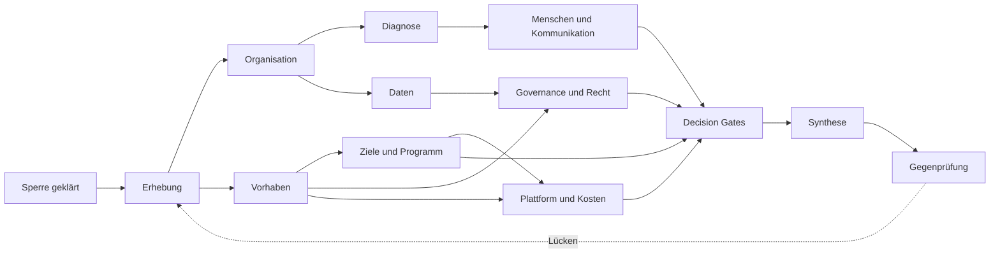

# Wie die Teile zusammenhängen

**Vorlagenstand:** 02.10.2026 · **Art:** Struktur der Ablage, kein Organigramm.

Die Pfeile zeigen, was wovon lebt. Keine Kante ist eine nachgewiesene Ursache.

## Die Knoten öffnen

- [Sperre](../datenverarbeitung.md) und [Fall](../fall.md)
- [Erhebungsplan](../../01%20Erhebung/erhebungsplan.md) und [Quellenverzeichnis](../../01%20Erhebung/quellenverzeichnis.md)
- [Profil](../../02%20Organisation/profil.md), [Menschen](../../02%20Organisation/menschen.md), [Systeme und Daten](../../02%20Organisation/systeme-daten.md)
- [Portfolio](../../03%20Vorhaben/portfolio.md)
- [Decision Gates](../../05%20Ziele%20und%20Programm/decision-gates.md)
- [Challenge-Register](../../11%20Gegenpr%C3%BCfung/Challenge-Register.md)

## Die tatsächliche Organisation abbilden

Sobald Rollen, Gremien und Systeme in `02 Organisation` stehen, lassen sie sich in `Werkzeuge/knoten.py` eintragen. Die Landkarte erzeugt daraus je Knoten eine Notiz und zeigt, in welchen Analysen er vorkommt.
